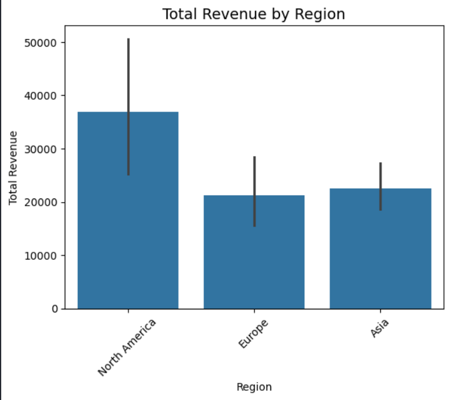
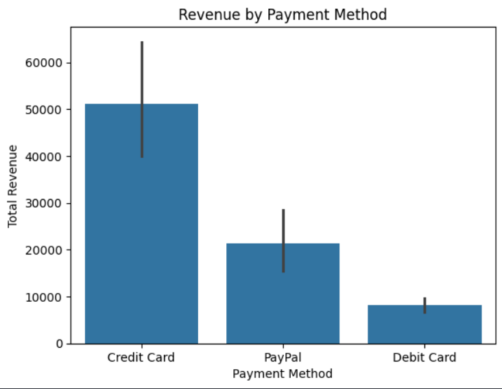

# 🌍 Global Sales Analysis

A data visualization project exploring global sales performance across regions, products, and payment methods using **Python**, **Pandas**, **Matplotlib**, and **Seaborn**.

---

## 📊 Overview

This project analyzes a synthetic dataset containing sales data such as revenue, region, product category, and payment method.  
The goal was to identify patterns and trends in sales across different dimensions.

---

## ⚙️ Technologies Used

- **Python**
- **Jupyter Notebook**
- **Pandas**
- **Matplotlib**
- **Seaborn**

---

## 🧩 Steps Involved

1. **Data Loading & Cleaning**  
   - Imported and explored dataset using Pandas  
   - Checked for missing values and ensured proper data types  

2. **Exploratory Data Analysis (EDA)**  
   - Visualized sales distribution across different regions  
   - Analyzed product performance and payment methods  
   - Tracked monthly sales trends  

3. **Visualization**  
   - Used Seaborn and Matplotlib for clear, insightful visualizations  

---

## 🔍 Key Insights

1. 💳 **Credit card** is the most common method of payment  
2. 📉 A noticeable **sales drop between April and July** was observed  
3. 📸 **Canon EOS R5 Camera** contributed the **highest total revenue**

---

## 📊 Visual Highlights

**Sales by Region**

**Top Products by Revenue**

**Payment Method Distribution**

---
## 🔗 View the Notebook

Since GitHub sometimes fails to render `.ipynb` files properly,  
you can view the fully rendered version on **nbviewer** here:

👉 [**View Full Notebook on nbviewer**](https://nbviewer.org/github/Ashprojecto/Global-Sales-Analysis/blob/main/Sales_analysis.ipynb)

 